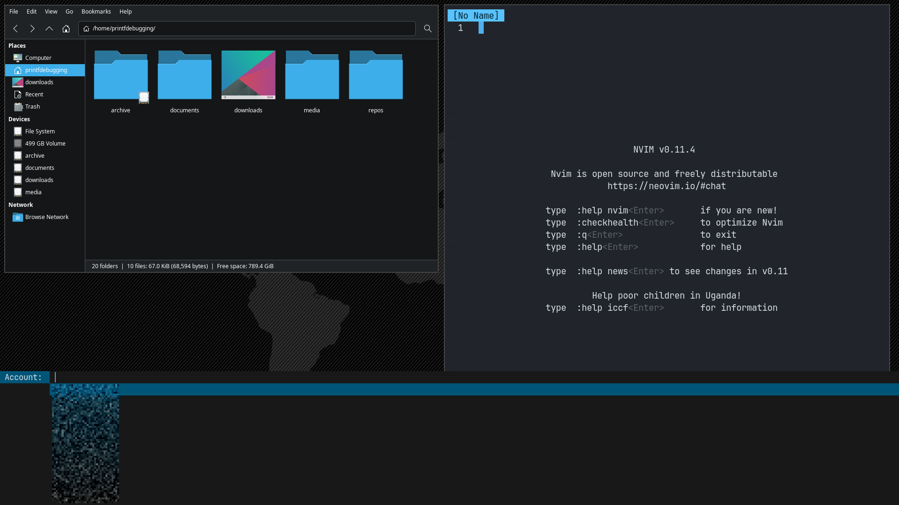
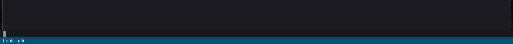
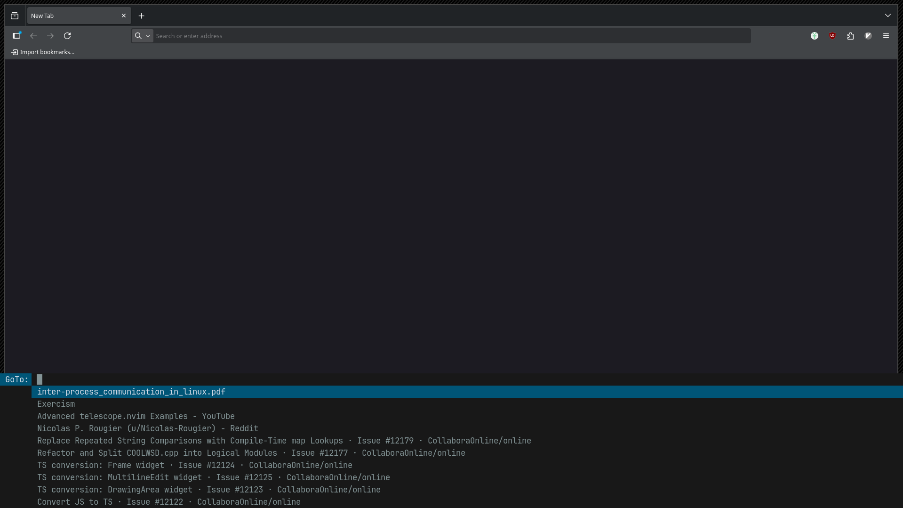
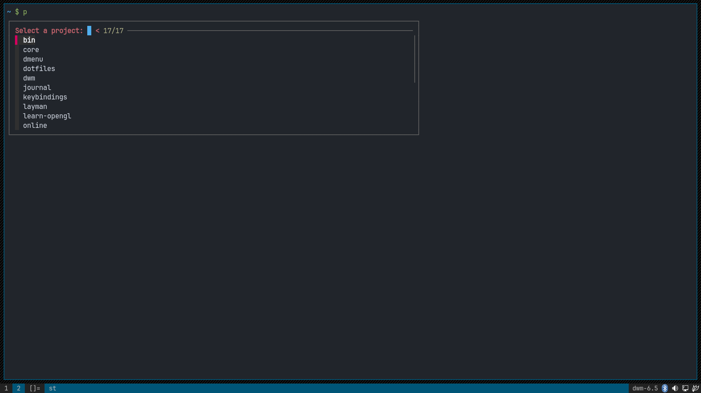

# bin

my beloved shell scripts live here. they automate things for me,
things like bookmarks, password/otp selection/generation, pastebin
related usecases, project navigation and tmux.

## password menu

[cred] is my password management script. i can either copy the 
password to my clipboard or i can use `xdotool` to type it out (which 
is what i do). this script depends on `pass` and `pass-otp` packages
which are available on most linux distributions.

for this script to work, you need to setup [pam-gnupg] and [pass]. you
would also need a gpg key on your system with the same password as your 
login password for [pam-gnupg]. you initialize your password-store with 
the same email id as that of the gpg key, and pam-gnupg caches the
password on startup so that any calls to `pass show account_name`
shows you the password of that account without the gpg prompt.

`pass-otp` along with flameshot lets you scan any 2fa qr code on your
screen, then it asks you for the account name. once setup, you can get
the otp using `pass otp show account_name` and you get the 2fa code.
no more mobile phones!

[pam-gnupg]: https://github.com/cruegge/pam-gnupg
[pass]: https://www.passwordstore.org/
[cred]: ./cred

## the bookmark script

> this script is from my archlinux/voidlinux ricing days, around the
> start of the third semester of btech. i remember i wrote this script
> at night with a lot of help from #bash irc channel members, thanks!.

the idea behind [bookmark] is quite simple, it first checks using
xdotool whether the current window is a browser window or not. if
it's a browser window, then it uses `xdotool` to send `<C-l>` then
`<C-c>` then `<Escape>` to the browser in that exact sequence. that
effectively copies the url in the url bar of the current tab to the
clipboard. it gets the title using `xprop`. 

so in the end, it has the url and the title. then it just appends the
url to a file. there was one big issue with this script. when i bound
it to `<Mod-b>`, it didn't work because it executed so fast that me
pressing that keyboard shortcut (`<Mod-b>`) interrupted the url copy
process.

the solution to that problem was quite simple i.e. to have another
script [bookmark-dwm] which we execute on the key press `<Mod-b>` and
it shows a dmenu prompt with only one option `bookmark`. you just
press `<Enter>` and the [bookmark] script executes without any issue
as `<Enter>` doesn't interrupt the url copy process.

[bookmark]: ./bookmark
[bookmark-dwm]: ./bookmark-dwm
[getbookmark]: ./getbookmark

then [getbookmark] script just puts the contents of the bookmark file
in dmenu and opens the url in the browser for the entry which you
select. it also puts that url into the clipboard.

## pastebin script

[term] is my pastebin script. it pipes the content of your clipboard
to [termbin] and once we get a url for the paste, it's copied to the
clipboard.

[term]: ./term
[termbin]: https://termbin.com

## projects

the [projects](./projects) script creates a nice fzf popup which lists
all the directories from my projects directory. once i select one of
these, it checks if tmux is running or not, if it is running, it just
opens the selected project in neovim. if tmux is not running, it opens
the project in a new tmux session.

## tmux split term

i used [toggle-term] in neovim for quite a while but the builtin
terminal doesn't work well with bash's vi mode because bash's normal
and insert modes are overridden by neovim's normal and insert modes.
[tmux-toggle-term] splits the current tmux session's current tmux pane
into two such that the second one is treated as a terminal panel.

this works quite well with my simple tmux workflow, it might need some
modifications for more complex workflows involving multiple sessions.

[toggle-term]: https://github.com/akinsho/toggleterm.nvim
[tmux-toggle-term]: ./tmux-toggle-term
